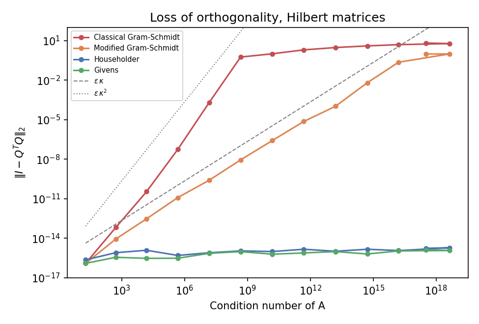
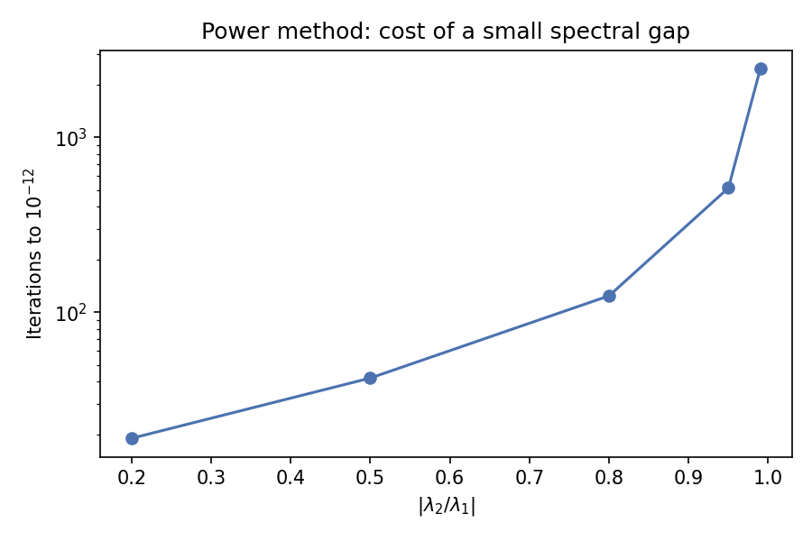
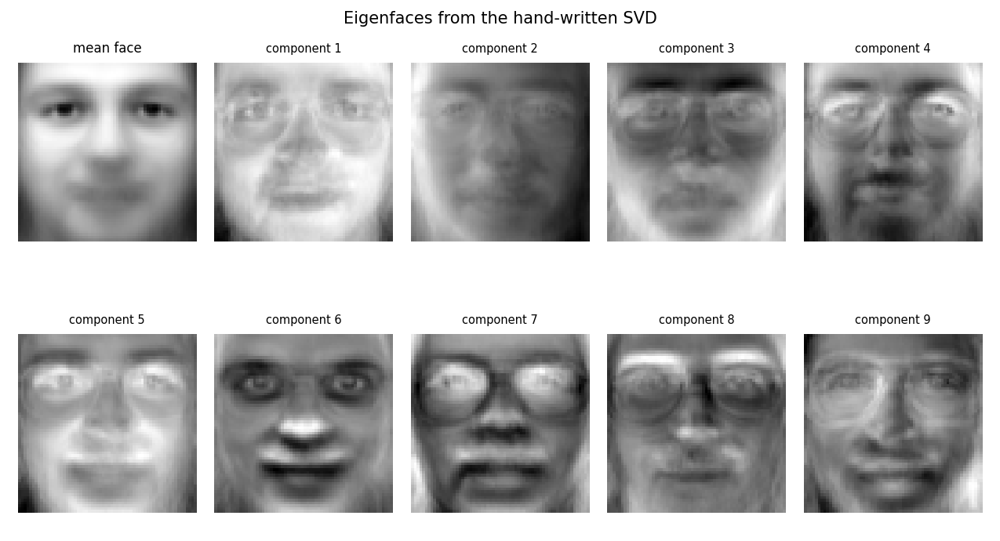
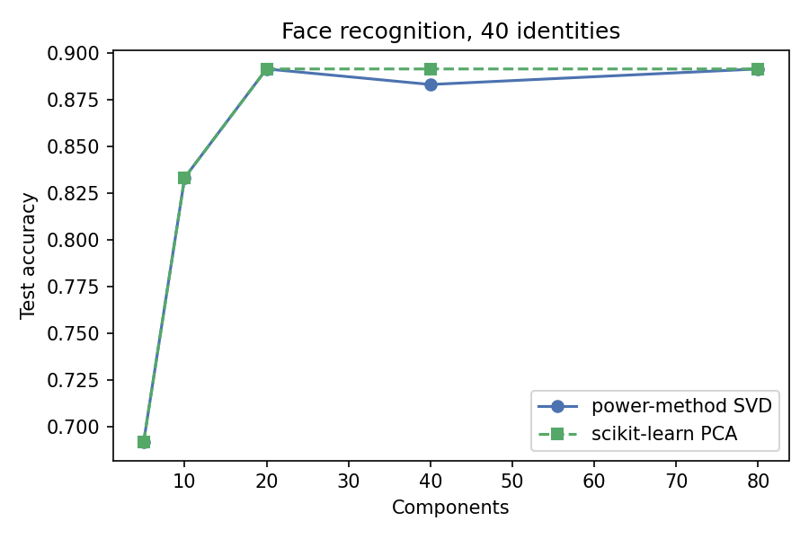

# Numerical linear algebra, written out

Generated 2026-09-24 by `python -m numla.study`. Every algorithm here is implemented from scratch; LAPACK appears only as the reference the tests check against.

## 1. Why nobody uses classical Gram-Schmidt

Four QR factorisations, run on Hilbert matrices of growing condition number. The measure is departure from orthogonality, $\|I - Q^TQ\|_2$.

| n | Condition number | Classical GS | Modified GS | Householder | Givens |
| --- | --- | --- | --- | --- | --- |
| 4 | 1.6e+04 | 3.5e-11 | 3.0e-13 | 1.2e-15 | 3.0e-16 |
| 6 | 1.5e+07 | 2.0e-04 | 2.5e-10 | 7.8e-16 | 7.1e-16 |
| 8 | 1.5e+10 | 1.0e+00 | 2.6e-07 | 9.7e-16 | 6.1e-16 |
| 10 | 1.6e+13 | 3.0e+00 | 1.0e-04 | 1.0e-15 | 9.6e-16 |
| 12 | 1.6e+16 | 5.0e+00 | 2.3e-01 | 1.2e-15 | 1.1e-15 |
| 14 | 3.2e+17 | 6.6e+00 | 9.6e-01 | 1.7e-15 | 1.3e-15 |

Classical Gram-Schmidt stops producing an orthogonal Q at n = 7: the error reaches order 1, meaning the computed columns are no longer independent in any useful sense. Modified Gram-Schmidt - which differs by *one line*, subtracting each projection from the running vector instead of the original column - survives several orders of magnitude longer. Householder and Givens sit at machine precision throughout, because they apply exactly orthogonal transformations rather than accumulating subtractions.

The grey guides are $\varepsilon\kappa$ and $\varepsilon\kappa^2$: the measured curves track the theory.

## 2. What the power method costs

Convergence is geometric at rate $|\lambda_2/\lambda_1|$, so the cost is set by the spectral gap and nothing else.

| $|\lambda_2/\lambda_1|$ | Iterations to $10^{-12}$ | Observed decay rate |
| --- | --- | --- |
| 0.20 | 19 | 0.200 |
| 0.50 | 42 | 0.500 |
| 0.80 | 124 | 0.800 |
| 0.95 | 513 | 0.950 |
| 0.99 | 2456 | 0.990 |

The observed decay matches the predicted ratio to three decimals. A gap of 0.99 needs 2,456 iterations against 19 for a gap of 0.2 - the same algorithm, a hundredfold difference in work.

## 3. PageRank is the power method

A six-page graph including one dangling node. Power iteration converged in 41 steps and agrees with a full eigendecomposition to 1.5e-13.

| Page | Rank (power) | Rank (eigendecomposition) |
| --- | --- | --- |
| 0 | 0.2024 | 0.2024 |
| 1 | 0.1309 | 0.1309 |
| 2 | 0.2399 | 0.2399 |
| 3 | 0.1886 | 0.1886 |
| 4 | 0.0983 | 0.0983 |
| 5 | 0.1400 | 0.1400 |

Damping is not a tuning knob but a fix for a structural problem: without it a disconnected component traps the random surfer and the stationary distribution is not unique. Its value still changes the answer:

| Damping | Page 0 | Page 1 | Page 2 | Page 3 | Page 4 | Page 5 |
| --- | --- | --- | --- | --- | --- | --- |
| 0.50 | 0.184 | 0.143 | 0.208 | 0.180 | 0.127 | 0.158 |
| 0.75 | 0.197 | 0.134 | 0.230 | 0.186 | 0.107 | 0.147 |
| 0.85 | 0.202 | 0.131 | 0.240 | 0.189 | 0.098 | 0.140 |
| 0.95 | 0.209 | 0.129 | 0.250 | 0.191 | 0.090 | 0.132 |

## 4. Eigenfaces on the hand-written SVD

Olivetti faces: 40 identities, 280 training and 120 test images at 64x64. The basis comes from `power_svd`, not from a library.

| Components | Accuracy (power-method SVD) | Accuracy (scikit-learn PCA) |
| --- | --- | --- |
| 5 | 0.692 | 0.692 |
| 10 | 0.833 | 0.833 |
| 20 | 0.892 | 0.892 |
| 40 | 0.883 | 0.892 |
| 80 | 0.892 | 0.892 |

Matching scikit-learn is the point: it shows the hand-written decomposition is not merely producing plausible pictures. Note what the compression buys - each face is described by 80 numbers rather than 4,096, a reduction of 51 times, with accuracy holding.

## Limitations

- `power_svd` forms $A^TA$, which squares the condition number and loses singular values below about $10^{-8}$ of the largest. Fine when the small directions are noise, wrong when they are the answer; LAPACK never forms the Gram matrix.
- Deflation accumulates error across eigenpairs, so a full spectrum built this way degrades as it goes.
- These implementations are for understanding and for testing, not for speed. They are unblocked, uncached and single-threaded.